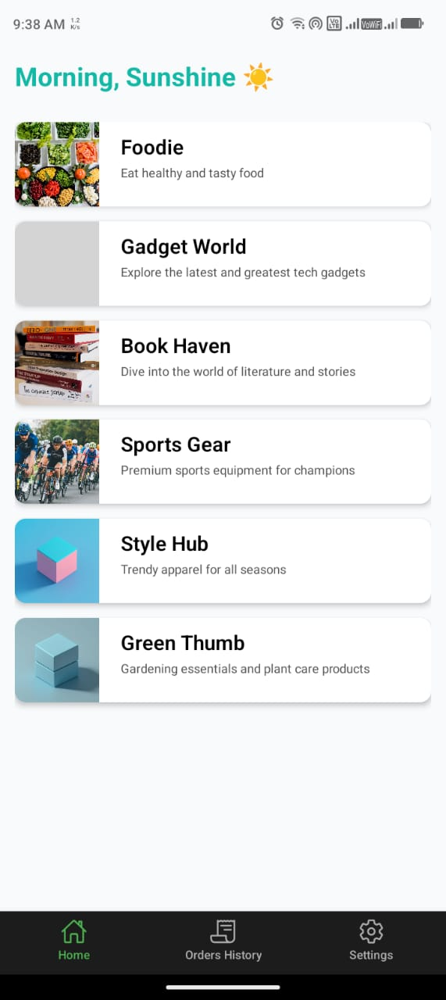
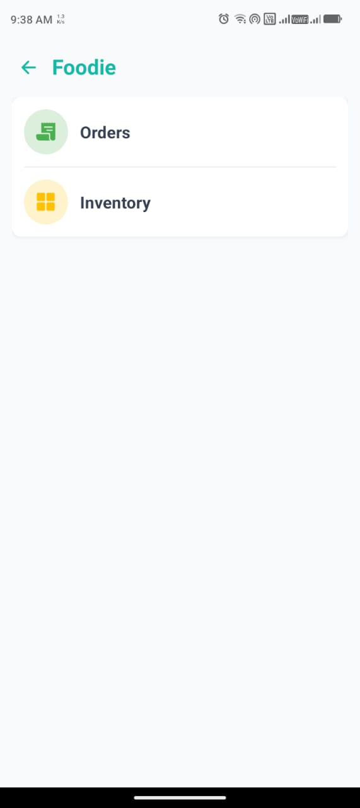
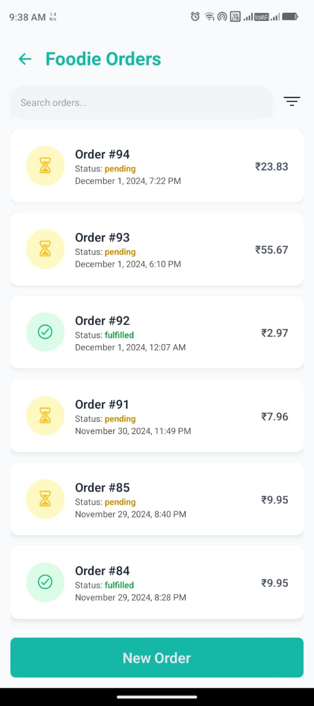
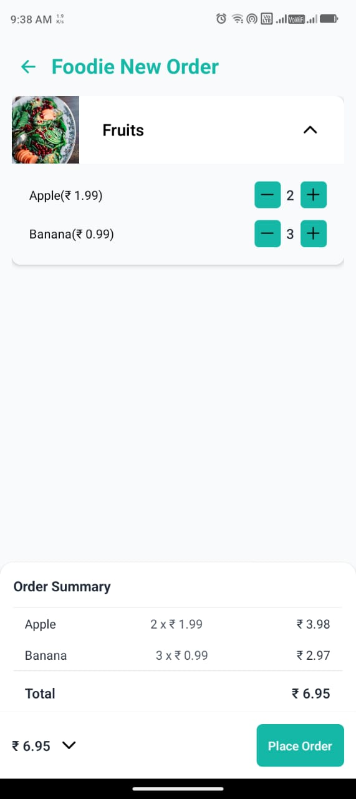
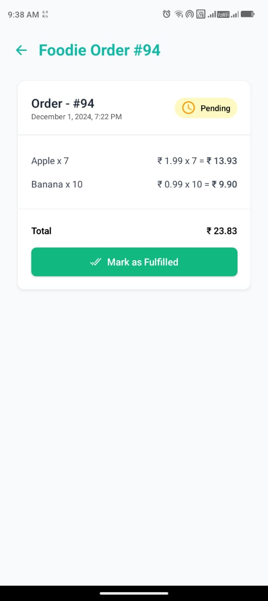
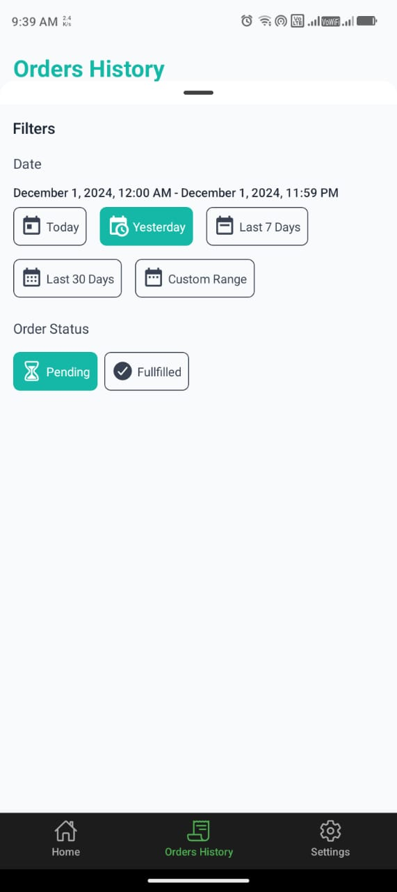
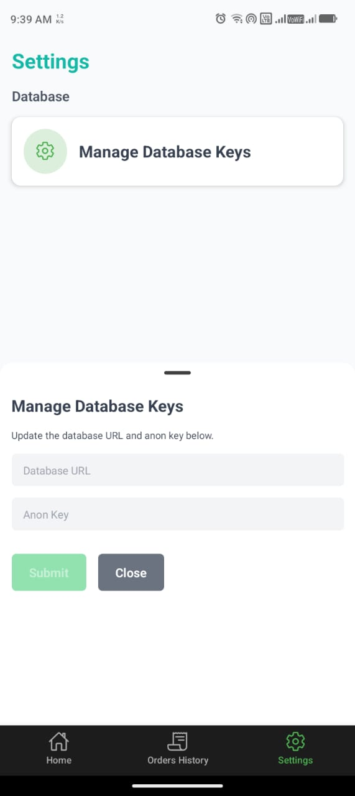

# OMA - Order Management Application 📦

A sleek and intuitive mobile application to efficiently manage orders across multiple stores, ensuring smooth operation and data sharing among employees. Built for small businesses, OMA simplifies the complexities of store, inventory, and order management.

---

## 📋 Features

- **Multi-Store Management**: Seamlessly manage orders across multiple stores.
- **Inventory Viewing**: View and monitor store inventory in real-time.
- **Order Management**: Create, view, and manage orders with ease.
- **Order Details**: Access detailed information about individual orders for better oversight.
- **Future Ready**: Plans to implement authorization to isolate data for each store.

---

## 🚀 Tech Stack

- **Frontend**: [React Native](https://reactnative.dev/) with [Expo](https://expo.dev/).
- **Backend/Database**: [Supabase](https://supabase.com/).

---

## 🛠️ Installation and Setup

### 1. Clone the Repository

```bash
git clone https://github.com/Thakur127/oma.git
cd oma
```

### 2. Install Dependencies

Ensure you have [Node.js](https://nodejs.org/) installed. Then, run:

```bash
npm install
```

### 3. Set up Supabase

- Create a project on [Supabase](https://supabase.com/).
- Navigate to the **SQL Editor** section, click on the "+" icon, and create a new snippet. Paste the following SQL code and click the green "Run" button(ctrl + enter key) to set up the database:

```sql
-- Stores Table
create table if not exists public.stores (
    id bigserial primary key,
    name varchar(128) not null,
    description varchar(256),
    image_url text,
    is_active boolean default true,
    is_deleted boolean default false,
    updated_at timestamp default current_timestamp,
    created_at timestamp default current_timestamp
);

create index if not exists "stores_name_idx" on public.stores(id);
alter table stores enable row level security;
create policy "Everyone allowed to view stores"
    on public.stores for select to anon using (true);

-- Categories Table
create table if not exists public.categories (
    id bigserial primary key,
    name varchar(128) not null,
    image_url text,
    is_active boolean default true,
    is_deleted boolean default false,
    store_id bigint not null references stores(id),
    updated_at timestamp default current_timestamp,
    created_at timestamp default current_timestamp
);

create index if not exists "categories_name_idx" on public.categories(id);
create index if not exists "categories_store_id_idx" on public.categories(store_id);
alter table categories enable row level security;
create policy "Everyone allowed to view categories"
    on public.categories for select to anon using (true);

-- Items Table
create table if not exists public.items (
    id bigserial primary key,
    name varchar(128) not null,
    price numeric(10, 2) not null,
    stock_count int check(stock_count >= 0),
    category_id bigint not null references categories(id),
    store_id bigint not null references stores(id),
    is_active boolean default true,
    is_deleted boolean default false,
    updated_at timestamp default current_timestamp,
    created_at timestamp default current_timestamp
);

create index if not exists "items_name_idx" on public.items(id);
create index if not exists "items_store_id_idx" on public.items(store_id);
alter table items enable row level security;
create policy "Everyone allowed to view items"
    on public.items for select to anon using (true);

-- Orders Table
create type "order_status" as enum ('pending', 'fulfilled');

create table if not exists public.orders (
    id bigserial primary key,
    store_id bigint not null references stores(id),
    total numeric(10, 2) not null,
    status order_status not null,
    is_deleted boolean default false,
    updated_at timestamp default current_timestamp,
    created_at timestamp default current_timestamp
);

create index if not exists "orders_store_id_idx" on public.orders(store_id);

-- Order Items Table
create table if not exists public.order_items (
    order_id bigint not null references orders(id),
    item_id bigint not null references items(id),
    quantity int check(quantity > 0),
    primary key (order_id, item_id)
);

-- Triggers to update 'updated_at' column
CREATE OR REPLACE FUNCTION update_updated_at_column()
RETURNS TRIGGER AS $$
BEGIN
    NEW.updated_at = CURRENT_TIMESTAMP;
    RETURN NEW;
END;
$$ LANGUAGE plpgsql;

CREATE TRIGGER set_updated_at_stores
    BEFORE UPDATE ON public.stores FOR EACH ROW EXECUTE FUNCTION update_updated_at_column();
CREATE TRIGGER set_updated_at_categories
    BEFORE UPDATE ON public.categories FOR EACH ROW EXECUTE FUNCTION update_updated_at_column();
CREATE TRIGGER set_updated_at_items
    BEFORE UPDATE ON public.items FOR EACH ROW EXECUTE FUNCTION update_updated_at_column();
CREATE TRIGGER set_updated_at_orders
    BEFORE UPDATE ON public.orders FOR EACH ROW EXECUTE FUNCTION update_updated_at_column();

-- Function to Create Orders
create type public.order_item_type AS (
    item_id bigint,
    quantity int
);

create or replace function create_order(
    o_store_id bigint,
    o_items order_item_type[],
    o_status order_status default 'pending'::order_status
)
returns table(id bigint, total numeric(10, 2), status order_status, created_at timestamp, store_id bigint)
as $$
declare
    new_order_id bigint;
    item_total numeric(10, 2);
    order_total numeric(10, 2) := 0;
begin
    insert into public.orders(store_id, total, status) values (o_store_id, '0', o_status) returning orders.id into new_order_id;

    foreach item in array o_items
    loop
        insert into public.order_items(order_id, item_id, quantity) values (new_order_id, item.item_id, item.quantity);
        select price * item.quantity into item_total from public.items where items.id = item.item_id;
        order_total := order_total + item_total;
    end loop;

    update public.orders set total = order_total where orders.id = new_order_id;

    return query select id, total, status, created_at, store_id from public.orders where id = new_order_id;
end;
$$ language plpgsql;
```

- Now to add data to the tables, run the following commands:

```sql
INSERT INTO public.stores (id, name, description, image_url, created_at) VALUES
(1, 'Foodie', 'Eat healthy and tasty food', 'https://images.unsplash.com/photo-1498837167922-ddd27525d352?q=80&w=1470&auto=format&fit=crop&ixlib=rb-4.0.3', NOW()),
(2, 'Gadget World', 'Explore the latest and greatest tech gadgets', 'https://images.unsplash.com/photo-1580910051075-0098a759ae13?q=80&w=1470&auto=format&fit=crop&ixlib=rb-4.0.3', NOW()),
(3, 'Book Haven', 'Dive into the world of literature and stories', 'https://images.unsplash.com/photo-1512820790803-83ca734da794?q=80&w=1470&auto=format&fit=crop&ixlib=rb-4.0.3', NOW()),
(4, 'Sports Gear', 'Premium sports equipment for champions', 'https://images.unsplash.com/photo-1517649763962-0c623066013b?q=80&w=1470&auto=format&fit=crop&ixlib=rb-4.0.3', NOW()),
(5, 'Green Thumb', 'Gardening essentials and plant care products', 'https://images.unsplash.com/photo-1556912990-d6f23aa168ea?q=80&w=1470&auto=format&fit=crop&ixlib=rb-4.0.3', NOW()),
(6, 'Style Hub', 'Trendy apparel for all seasons', 'https://images.unsplash.com/photo-1593032465175-399817ed4483?q=80&w=1470&auto=format&fit=crop&ixlib=rb-4.0.3', NOW());

INSERT INTO public.categories (id, name, image_url, store_id, created_at) VALUES
(1, 'Fruits', 'https://images.unsplash.com/photo-1511690743698-d9d85f2fbf38?q=80&w=1470&auto=format&fit=crop&ixlib=rb-4.0.3', 1, NOW()),
(2, 'Tech', 'https://images.unsplash.com/photo-1517430816045-df4b7de99fb5?q=80&w=1470&auto=format&fit=crop&ixlib=rb-4.0.3', 2, NOW()),
(3, 'Books', 'https://images.unsplash.com/photo-1553729784-e91953dec042?q=80&w=1470&auto=format&fit=crop&ixlib=rb-4.0.3', 3, NOW()),
(4, 'Sports', 'https://images.unsplash.com/photo-1589987603588-a67d4b6f26a5?q=80&w=1470&auto=format&fit=crop&ixlib=rb-4.0.3', 4, NOW()),
(5, 'Gardening', 'https://images.unsplash.com/photo-1563224174-a3f023a1714b?q=80&w=1470&auto=format&fit=crop&ixlib=rb-4.0.3', 5, NOW()),
(6, 'Clothing', 'https://images.unsplash.com/photo-1541099649105-f69ad21f3246?q=80&w=1470&auto=format&fit=crop&ixlib=rb-4.0.3', 6, NOW());

INSERT INTO public.items (id, name, price, stock_count, category_id, store_id, created_at) VALUES
(1, 'Apple', 1.99, 10, 1, 1, NOW()),
(2, 'Banana', 0.99, 20, 1, 1, NOW()),
(3, 'Laptop', 799.99, 5, 2, 2, NOW()),
(4, 'Smartphone', 599.99, 8, 2, 2, NOW()),
(5, 'Fiction Novel', 12.99, 40, 3, 3, NOW()),
(6, 'Soccer Ball', 25.99, 15, 4, 4, NOW()),
(7, 'Yoga Mat', 19.99, 10, 4, 4, NOW()),
(8, 'Flower Pot', 5.99, 50, 5, 5, NOW()),
(9, 'Casual T-Shirt', 14.99, 30, 6, 6, NOW()),
(10, 'Winter Jacket', 49.99, 10, 6, 6, NOW());

INSERT INTO public.orders (id, store_id, total, status, created_at) VALUES
(1, 1, 3.97, 'pending', NOW()),
(2, 2, 799.99, 'fulfilled', NOW()),
(3, 6, 29.98, 'pending', NOW()),
(4, 4, 25.99, 'fulfilled', NOW()),
(5, 5, 29.95, 'pending', NOW());

INSERT INTO public.order_items (order_id, item_id, quantity) VALUES
(1, 1, 1),  -- 1 Apple
(1, 2, 2),  -- 2 Bananas
(2, 3, 1),  -- 1 Laptop
(3, 9, 2),  -- 2 Casual T-Shirts
(4, 6, 1),  -- 1 Soccer Ball
(5, 8, 5);  -- 5 Flower Pots
```

- For API Keys, Go the Project Settings > Configuration > API. From Project URL Section copy "URL" and "Anon Key" from Project API Keys Section and store them somewhere.

### 4. Run the Application

Start the app locally using Expo:

```bash
npx expo start [-c]
```

- Use the `-c` flag to clear the cache.

- Install expo go from playstore or app store on your smartphone.
- Scan the QR Code from your expo go app to use the app.
- Go to Settings > Manage Database Keys, and now paste those stored keys here and save. Now Navigate back to home screen, and refresh the app by swiping down.

### 5. Build the APK (Optional)

Follow Expo's [guide to build standalone apps](https://docs.expo.dev/build/introduction/).

---

## 📷 Screenshots

### Splash Screen


### Home Screen



### Store Navigation



### Store Orders



### New Order



### Order Details



### Order Filtering



### Settings



---

## 📈 Future Enhancements

- **Authorization**: Add user-specific access to store data for enhanced security.
- **Advanced Order Filtering**: Include additional filters and sorting options.
- **Notifications**: Real-time updates for order status changes.

---

## 🤝 Contributions

Contributions, issues, and feature requests are welcome!  
Feel free to check the [issues page](https://github.com/Thakur127/oma/issues).

---

## 📝 License

This project is licensed under the [MIT License](LICENSE).

---

## 💬 Contact

- **Email**: [ravithakur.dev7@gmail.com](mailto:ravithakur.dev7@gmail.com)
- **Twitter**: [@ravithakur_7](https://x.com/ravithakur_7)
